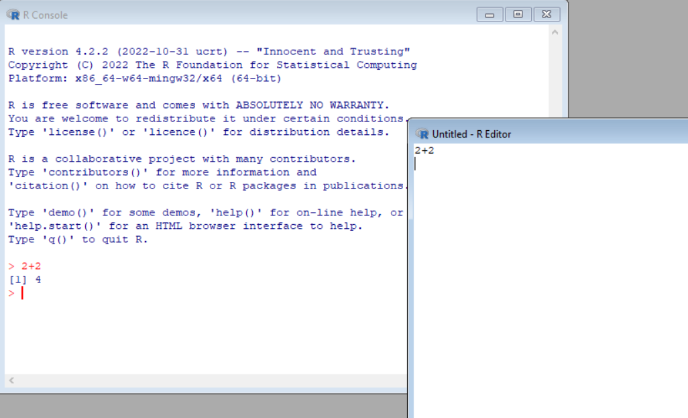
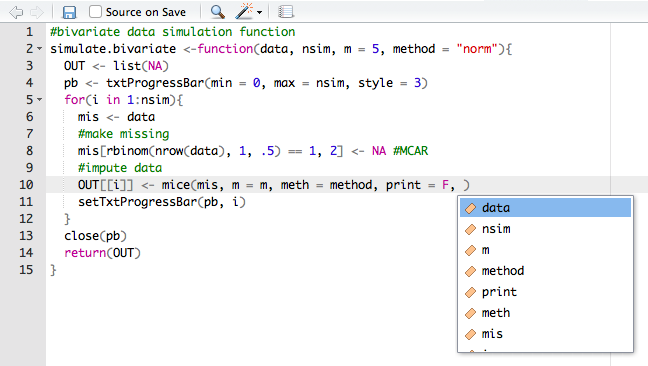

# Overview of this course
## Scope
* Familiarity with R and RStudio
* Reading and writing data in various formats
* Data manipulation with tidyverse
* Aggregating and summarizing
* Data visualization

## Info
* All up-to-date info and material on webpage: (https://peterstoltze.github.io/R_BiH_2023/)
* Two sessions per day
* Lecture - Exercise - Repeat

## Program

| Day       | Time        | Topic                                           |
|:----------|:------------|:------------------------------------------------|
| Monday    | 10.00-12.00 | Introduction to R and RStudio                   |
|           | 13.00-15.30 | Datatypes in R and basic syntax                 |
| Tuesday   | 09.00-11.30 | Reading external data into R                    |
|           | 13.00-15.30 | Data manipulation and tidyverse                 |
| Wednesday | 09.00-11.30 | Your own project                                |
|           | 13.00-15.30 | Your own project (continued)                    |

## Lecture A - Introduction to R and Rstudio

In this lecture we will look at:

* R and RStudio IDE
* Working environment
* Objects and assignment
* Writing code and executing

# What is R?

## Software
<center>

</center>

<div class="notes">
Scripting language unlike compiled language  
Interactive
Base R gives you the console  
Very basic, but enough for very basic  
</div>

## The origin of R

- Created in New Zealand to teach statistics in 1993

- R is a language and environment made for statistical computing and for graphics

- GNU project (100% free software)

- Managed by the R Foundation for Statistical Computing, Vienna, Austria.

- Community-driven

- Based on the object-oriented language S (1975)

# What is RStudio?

## Integrated Development Environment
<center>

</center>

## My desktop
<center>

</center>


## RStudio
- Aggregates all convenient information and procedures into one single place
- Allows you to work in projects
- Manages your code with highlighting
- Gives extra functionality (Shiny, knitr, markdown, LaTeX)
- Allows for integration with version control systems, such as Git.

## Editor and Console
 - Editor is for scripting
   * Can write multiple commands
   * You can easily run the commands again
   * Does not execute until you tell it to (Ctrl + Enter)
 - Console is for executing
   * One command at a time
   * Good for commands you only need to run once (like inspecting objects)
   * Not good for writing long commands

# How does R work

## Objects and elements
- R works with objects that consist of elements. The smallest elements are numbers and characters.

    - These elements are assigned to objects. 
    - A set of objects can be used to perform calculations
    - Calculations can be presented as functions
    - Functions are used to perform calculations and return new objects, containing calculated (or estimated) elements. 
   
## Assigning elements to objects
- Assigning things in R is very straightforward: 

    - you just use `<-`

- For example, if you assign the value `100` (an element) to object `a`, you would type

```{r}
a <- 100
```

- Life hack: In RStudio learn to use the shortcut "alt + -" (hyphen) to produce the left arrow `<-` in an R file


## Calling objects
- Calling things in R is also very straightforward: 

    - you just use type the name you have given to the object

- For example, we assigned the value `100` to object `a`. To call object `a`, we would type

```{r}
a
```

## Writing code
<center>

</center>

This is why we use R-Studio.


## The help
- Everything that is published on the Comprehensive `R` Archive Network (CRAN) and is aimed at `R` users, must be accompanied by a help file. 
- If you know the name of the function that performs an operation, e.g. `mean()`, then you just type `?mean` or `help(mean)` in the console. 
- If you do not know the name of the function: type `??` followed by your search criterion. For example `??mean` returns a list of all help pages that contain the word 'mean'

- Alternatively, the internet will tell you almost everything you'd like to know (and then some)

- Sites such as http://www.stackoverflow.com and http://www.stackexchange.com, as well as `Google` can be of tremendous help. 
    - If you google `R` related issues; use 'R:' as a prefix in your search term
 
# Practical A

