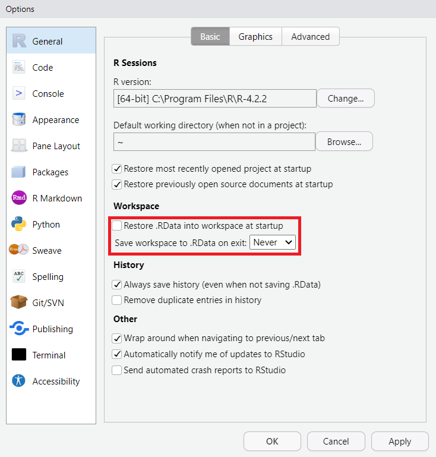

## Recap

- So far we have learned the basics of programming in `R`:
    - How to assign elements to objects (`<-`)
    - How to run code
    - How to save `R`-scripts
    - How to manage projects in `RStudio`
    - How to create notebooks or markdown HTML files
    - How to find help
- Now we will add a bit more building blocks

## Lecture B - Datatypes and syntax 

- In this lecture we will look the following subjects:  
  * Basic datatypes
  * Vectors, matrices, data frames, arrays, and lists
  * Logical operators
  * Factors
  * Functions
  * Missingness


```{r echo=FALSE}
set.seed(123)
```

## But first...
- RStudio has a feature where it saves all values in your environment
- This is bad for reproducibility...
- To disable it:
  - Click on Tools
  - Global Options...
  - Remove checkmark in "Restore .RData into workspace at startup"
  - Set the option "Save workspace to .RData on exit" to "Never"
- This plays nicely together with "Restart R" (Ctrl + Shift + F10)

## But first...
<center>

</center>

# Datatypes and vectors
## Datatypes
- The smallest object in R is called an atomic element.
- Three basic datatypes:
  * Numeric (double, integer and complex)
  * Character
  * Logical

## Datatypes
* Numeric
```{r}
a_number <- 5.2
```
* Numeric operators
```{r}
a_number+2
```
* Is it numeric?
```{r}
is.numeric(a_number)
```

## Datatypes
* Character
```{r}
a_character <- "A"
a_sentence <- "A full sentence"
not_a_number <- "5.2"
```

* Difference in printing
```{r}
not_a_number
```
* Is it a character
```{r}
is.character(a_character)
```

## Datatypes
* Logical
```{r}
logic <- TRUE
no_logic <- FALSE
```

* Logical operators
```{r}
TRUE & FALSE
```
```{r}
TRUE | FALSE
```

## Conversion  
- You can convert types with `as."datatype":
```{r error = TRUE}
a_number + not_a_number
```
```{r}
a_number + as.numeric(not_a_number)
```
- Not all conversions are possible
```{r error = TRUE}
as.numeric(a_sentence)
```

## Conversion
- You can always convert
  - Logical to numeric (`FALSE=0` and `TRUE=1`)
  - Numeric to logical (`FALSE` if numeric is `0` else always `TRUE`)
  - Numeric to character (`6.7` will become `"6.7"`)
- You can convert convert character to numeric if it **ONLY** contains numbers
- You can convert character to logical if it is **ONLY** `"TRUE"` or `"FALSE"`
- If R do not know how to convert you get a missing value (`NA`)

## Check datatype
- If you do not know the datatype you can use the `typeof`-function to get it
```{r}
typeof(a_number)
```

# Vectors and matrices

## Numerical vectors
- Several elements of the same type, e.g. the integers from 1 to 5, can be concatenated into a **vector**
```{r}
a <- c(1, 2, 3, 4, 5)
a
```

## Character vectors
- Similarly we can add a character to our vector
```{r}
a.new <- c(a, "A")
a.new
```

- Notice the difference with `a` from the previous slide
```{r}
a
```
- This is because vectors can only contain one datatype!

## Vectors
- To call single elements in vectors, e.g. if we want to refer to the third element of `a`, we type
```{r}
a[3]
```
- Or several elements
```{r}
a[c(1,3)]
```

- This is called *indexing* and used to be the way to subset data - we will see an easier way to do this later...

## Matrices
- A rectangular organization of *n* x *m* elements of same datatype in *n* rows and *m* columns is known as a **matrix**, both in `R` and more generally
```{r}
c <- matrix(a, nrow = 5, ncol = 2)
c
```

- Notice that `R` is **recycling** `a` without lettting us know!
- Also notice that the name of the matrix could cause trouble!!

##
- Referencing elements in a matrix is done by **indices**, e.g. the first row is called by
```{r}
c[1, ]
```

##
- The second column is called by
```{r}
c[, 2]
```

##
- The intersection of the first row and second column is called by
```{r}
c[1, 2]
```

- In short, the square brackets [] are used to call elements, rows, columns (and much more beyond the scope of this course)

## Trying to mix numerics and chars
- If we add a character column to matrix `c` everything becomes chars
```{r}
cbind(c, letters[1:5])
```

- Vectors and matrices are 1D or 2D structures holdning elements of the **same** type (numerical, characters or logicals)
- If we try to mix two types `R` will automatically *cast* in the following order:  
`logical`->`numeric`->`character`

# Data frames

## Data frames
- To keep variables of different types in a 2D structure, the simplest answer is a **data frame** 
```{r}
d <- data.frame("V1" = rnorm(5),
                "V2" = rnorm(5, mean = 5, sd = 2), 
                "V3" = letters[1:5])
d
```

- Here a data frame is constructed with two randomly generated sets from the normal distribution where $V1$ is standard normal and $V2 \sim N(5,2^2)$ and then an interesting character vector

## Data frames
- Data frames can contain all datatypes
- Each column can only contain one datatype
- Each row has the same columns

## Data frames
- The way to obtain the third row from the data frame `d` is:

```{r}
d[3, ]
```

## Data frames
- Calling columns in data frames can be done in precisely the same way
```{r}
d[, "V2"]
d[, 2]
```

## Data frames
- And the intersection can be called, just like with matrices:
```{r}
d[3:5,"V2"]
```
- Notice the `3:5` notation. In `R` this is shorthand for the integers from 3 to 5
```{r}
3:5
```


## Data frames
- However, we can also use `$` to call variable names in data frame objects
```{r}
d$V2
```
- Thus calling column vectors we can even write
```{r}
d$V2[3:4]
```


# Beyond two dimensions:<br>Arrays and lists

## Arrays
- If you wish to use single datatype objects that have more than two dimensions, an array would be a suitable object.

- The following code yields a 3-dimensional array, which may be thought of as 2 layers of a 3x4 matrix:
```{r}
e <- array(1:24, dim = c(3, 4, 2))
e
```

## Arrays  
- The square bracket identification works similarly to the identification of matrices and dataframes, but with the added dimension(s).
- So to get the element in the first row of the third column in the second matrix you type
```{r}
e[1, 3, 2]
```
- This is exactly the downside to an array: it is a series of matrices meaning that characters and numerical elements may not be mixed... 

## Arrays  
- So, we get problems if we replace the second matrix in the array by a character version of that same matrix
```{r}
e[, , 2] <- as.character(e[, , 2])
e
```
- As for matrices the entire array is cast to chars...

## The solution: Lists
- List are just what it says they are (i.e. lists), and you can have a list where the elements are of different types 
- For example, create a simple list by typing
```{r}
f <- list(a)
f
```

- Elements or objects within lists can be called by using **double** square brackets, e.g the first (and only) element in list `f` is vector `a`
```{r}
f[[1]]
```

## List  
- We can simply add an object or element to an existing list
```{r}
f[[2]] <- d
f
```
- Now our list consists of a vector and a data frame!

## List  
- We can add names to the list as follows
```{r}
names(f) <- c("vector", "data frame")
f
```

## List  
- With names to the elements we can call the vector `a` from the list as follows
```{r}
f[[1]]
f[["vector"]]
f$vector
```

## Lists in lists
- A construct more useful that it initially seems is a *list of lists*
- Here we have a list with two identical elements
```{r}
g <- list(f, f)
```

## Lists in lists
- To call the vector from the second list within the list `g`, use either of the following code
```{r}
g[[2]][[1]]
g[[2]]$vector
```

# Logical operators

## Logical operators
- Logical operators are operators that evaluate to either `TRUE` or `FALSE`
- The most common statement include
    - `==` (equal to)
    - `<` (smaller than)
    - `>` (greater than)
    - `<=` (smaller than or equal to)
    - `>=` (greater than or equal to)
- The operators may be combined using `|` (OR) as well as `&` (AND)
- Typing `!` before a logical operator takes the complement of that action
- There are more operations, but these are the most useful 

## Logical operators  
- Logical operators are great for subsetting, e.g. if we would like elements out of matrix `c` that are larger than 3, we would type:
```{r}
c[c > 3]
```

- Why does a logical statement on a matrix return a vector?
```{r}
c > 3
```
- The column values for `TRUE` may be of different length. A vector as a return is therefore more appropriate 

## Logical operators  
- If we would like the elements that are smaller than 3 or larger than 3, we could type
```{r}
c[c < 3 | c > 3]
```
- Analysing the query we realize that this is equivalent to asking for the elements **not** equal to 3
```{r}
c[c != 3] #c not equal to 3
```

## Logical operators  
- To understand the mechanism see how `c != 3` actually returns a Boolean matrix
```{r echo=FALSE}
c != 3
```
- And then recall the structure of `c` 
```{r echo=FALSE}
c
```

# Factors
## Factor
- Factor is a vector with predefined "allowed" values (levels)
```{r}
f <- factor(c("A", "B", "A", "B", "D"),
            levels = c("A", "B", "C"))
f
```
- Why is "D" not included?

## Factor
- Can be useful for categoricals
```{r}
fruits <- factor(c("Apple", "Potato"),
                 levels = c("Apple", "Banana"))
fruits
```

## Beware of factors - they are not what they seem!

Consider a data frame A:

```{r echo=FALSE}

A <- data.frame(V1 = 1:4, V2 = 4:1)

A[,1] <- as.factor(A[,1])
A[,2] <- as.factor(A[,2])

A

```

##

We can try to add elements of A: 

```{r echo=T}

A[2,1] + A[2,2]


```

But it seems logical enough to add them!

```{r echo=T}

typeof(A[2,1]) 

typeof(A[2,2])

```

##


Something weird is going on here!

```{r echo=T}

A[2,1] 

A[2,2]


```


##

The problem is caused by the elements of A being factors.

```{r echo=T}

A[2,2]


```

It's the keyword `Levels` that tells us that A is in fact a dataframe of factors.

Factors do cause a lot of trouble for this exact reason. So when you troubleshoot, check if your elements actually have the type that you think they have!

## Factors in R

- Sometimes R converts data to factors automatically when reading in the data.
  - This is not as big a problem as it used to be, but it is still a good idea to check

- Strings are sometimes converted to factors automatically (unless you use a data structure called a tibble).

- Sometimes we have to do it ourselves (if we want the data to be factors).

- You can make an element into a factor by using the function ´as.factor()´

- If you want something not to be a factor, you have to convert it back to the type of element you need it to be:

```{r echo=T}

as.integer(A[2,1]) + as.integer(A[2,2])

```


## Then why use factors?

- The factor is a data structure which is used for fields that take only predefined finite number of values. 

- These are the data objects which are used to categorise the data and to store it on multiple levels. 

- It can store both integers and strings values, and are useful in data that has a limited number of unique values.

- It generates a quick overview of the unique values of the data.

# Functions

## Functions
 - A function is an object that takes an argument and returns a result (generally)
 - We used several functions already:
   - `is.numeric`
   - `as.character`
   - `data.frame`
   - `rnorm`

## Functions
 - The generalized form of a function is:
```{r eval = F}
function(x, one_argument, another_argument)
```
 - An example is:
```{r}
mean(c(1,2,3,4,5))
```
 
## Functions
  - To check the arguments of a function we use the help
```{r echo = F, result = 'hide', message=F, warning=F}
library(printr)
```
  
```{r, eval = F}
?mean
```

## Functions
```{r, echo = F}
?mean
```

## Functions
- Here we can see there is 3 arguments:
  * `x`: An `R` object
  * `trim = 0`: Number that removes a fraction before the mean is calculated
  * `na.rm = FALSE`: Wether to remove `NA` from `x`.
  * `...`: Placeholder for future arguments. Do not worry about this one.

- So what about our example from before?
```{r, eval = FALSE}
mean(c(1,2,3,4,5))
```
 
## Functions
- It is translated into
```{r eval = FALSE}
mean(x = c(1,2,3,4,5),
     trim = 0,
     na.rm = FALSE)
```
- Notice two things:
  * We did not need to write `x=c(1,2,3,4,5)`. `R` assumes that the first
    argument we provide corresponds to the first argument in the function. This
    means that the order matter.
  * The arguments that have default values do not need to be provided if we are
    content with the defaults.
  * ... And `?`/`help` is our friend!
  
# A few final notes

## Missingness - Special numerics
- Expressions that have no representation in real number space (at least not without tremendous analytical effort) results in a "Not a Number"
```{r}
0 / 0
```

- Another special value is "Infinity"
```{r}
1/0
```

## Missingness - Not Available
- Unknown values are coded as `NA`/"Not Available"
```{r}
h <- c(1, 2, NA, 4, 5)
h
```
- Special type that can be included in all vectors
```{r}
j <- c("A", "B", NA, "D")
j
```

## Working with `NA`
- Of course the mean of a set of number including at least in NA is also impossible and therefore also missing
```{r}
mean(c(1, 2, NA, 4, 5))
```
- Often there is a argument called `na.rm`:
```{r}
mean(c(1, 2, NA, 4, 5), na.rm = TRUE)
```

## Another note: Beware of comparisons that include floats
```{r}
(3 - 2.9)
(3 - 2.9) <= 0.1
(3 - 2.9) - .1
```
# Practical

## How to approach the next practical
- Aim to make the exercises without looking at the answers
    - Use the answers to evaluate your work
    - Use the help to identify the workings of functions
- If this does not work out then switch to the answer-based practical 
- In any case feel free to ask for help when needed 
    - Do not struggle for too long since we only have limited time!