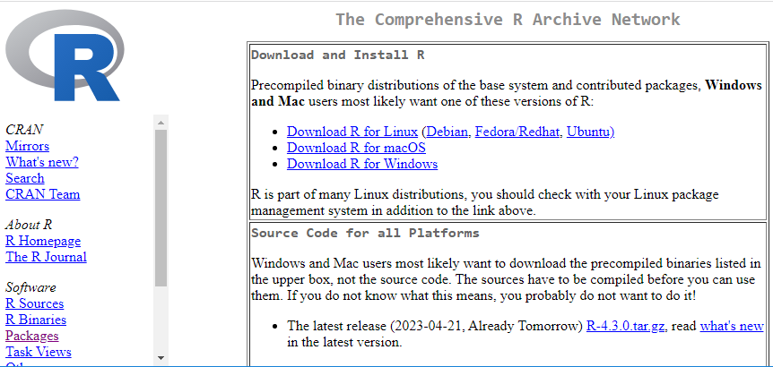
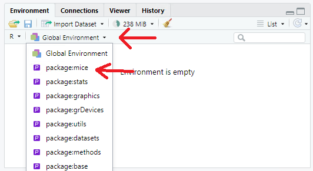
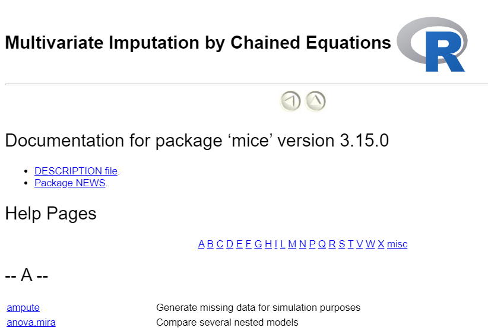
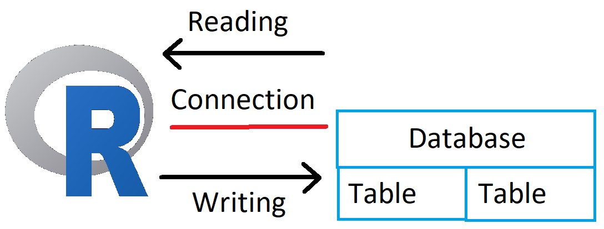

## Program

In this lecture we will look at:  

* Packages
* Reading CSV, SAS and Excel-files
* Writing CSV and Excel
* Reading and writing to a database
* Creating functions

# Packages
## Packages

- Until now we have worked with only the functionality in `base`
  - All R-installations have it
  - Powerful, robust and basic 
- But often we need more - that's where packages come in...

## What is a package?
- Packages are a collection of functions and datasets
- Extends the functionality of R
  - Read different file-formats (Excel, CSV, JSON, SAS...)
  - Create more advanced statistical models
  - Create beautiful figures, reports and webpages
  - Introduce more convenient methods for data manipulation
  - ... and much more
- An example is the package `mice` which can be used for Multivariate Imputation
by Chained Equations (don't worry about this, but is quite useful)

## Packages
 - Installation
```{r, eval = FALSE}
install.packages("mice")
```
 
 - Load it
```{r message = FALSE}
library(mice)
```

 - Use it
```{r}
boys[1:5,]
```
 
 
## Installation
 - New packages are installed with the function `install.packages`
 - It searches the CRAN-repository for packages with the provided name
 - More than 19470 packages. Generally of high quality.
 - Automatically install dependencies if needed

```{r message = T}
install.packages("mice")
```

## CRAN
- Comprehensive R Archive Network
- Can be found at [cran.r-project.org](https://cran.r-project.org/)
<center>

</center>

## Load it
 - Once a package is installed you can load it with `library`.
 - This attaches it to your session and you can use all the functions and datasets in it
 - But you can not see it in your environment?
 
```{r message = FALSE}
library(mice)
boys[1:3,]
```


```{r message = FALSE}
ls()
```

## Load it

If for some reasons you want to add the boys data set to your environment, just do it like this:
```{r}
data (boys)
```

Now it is there:
```{r}
ls()
```


## Load it
 - It is hidden underneath your global environment, so all the available functions do not clutter up you workspace
 


 - But you can use everything in it as though it is
 - See help-file for package with `?mice`
 
## See contents of package
- To see all the functions in a package you can write `help(package = "mice")`
- Takes you to the index help-page for the package

<center>

</center>

## Use it
 - Now we can call the functions and datasets in the package as other object we
 have created. For instance we now have access to the `boys`-dataset without loading
 the `boys.RData`
```{r}
boys[1:5,]
```

## Use it
 - To only load a single object from a package use the `package::object`-notation
 - Then you do not have to load the entire package
```{r}
mice::boys[1:3,]
```

## Finding packages
- Can be overwhelming
- Good places to start:
  - Tidyverse is a curated collection that shares design philosophy: [www.tidyverse.org/packages/](https://www.tidyverse.org/packages/)
  - If you are into official statistics: [github.com/SNStatComp/awesome-official-statistics-software](https://github.com/SNStatComp/awesome-official-statistics-software)
- Else Google is your friend, but do not take the first and best! 
  - Is it a popular package?
  - Check who the creator is and decide if you trust them
  - Is the project still maintained (i.e. when was the last update on github or where-ever the project lives)

## Getting more help
- Many of the popular packages have more user-friendly documentation called vignettes
```{r eval = FALSE}
browseVignettes("readr")
```

## Getting more help
- Some packages also have cheat sheets which you can find with google ("R: readr cheat sheet") or on [posit.co/resources/cheatsheets/](https://posit.co/resources/cheatsheets/)

<center>

</center>

## Getting more help
- Most popular packages should have either a good help page, a vignette or a cheat sheet... Or preferably all of them
- ...but often when you have problems the best source of help is the internet.

## Packages
We will use these packages in this lecture
```{r}
## For reading and writing files
library(readr)
library(haven)
library(openxlsx)

## For working with databases
library(DBI)
library(RSQLite)
```

# Reading datafiles
## Path to files
 - When you start R it has a Working Directory. It is either your systems userdirectory or the directory of your project.
 - To see your current Working Directory use the function `getwd`
```{r eval = FALSE}
getwd()
```
```{r echo = F}
"C:/Users/Morten"
```

- R will first look for files in your Working Directory

## Example
- I have created a small textfile called "example.txt" and put it in the path "C:/Users/Morten/example.txt"
- R can now find it easily because it is in my working directory.
- You just need to write:
```{r eval = F}
file("example.txt")
```
- Alternatively I could write the full path 
- Notice that we use slash (/) and not backslash(\\):
```{r eval = F}
file("C:/Users/Morten/example.txt")
```
- This is called a relative and an absolute path.

## Absolute vs. relative path
As a rule of thumb:  

- When the file is in your project folder you should use relative paths  
  - This makes your project portable and avoids unnecessary long paths
- If the file is a system file or on a shared drive you should use absolute paths

## Writing to files
- Often you would like to export your datasets into a permanent storage once you
are done working with them. An example we already used was `boys.RData`.
- Today we will export the same dataset to some more common formats.

## Writing to files
- Can be simple
```{r}
# CSV (using the package readr)
readr::write_csv2(boys, "files/boys.csv")

# Excel (using the package openxlsx)
openxlsx::write.xlsx(boys, "files/boys.xlsx")

# STATA (using the package haven)
haven::write_dta(boys, "files/boys.dta")
```
- All these functions have a lot of arguments!

## Reading from files
- Also simple
```{r message = F}
# CSV
boys_csv <- readr::read_csv2("files/boys.csv")

# Excel
boys_xlsx <- openxlsx::read.xlsx("files/boys.xlsx")

# SAS
boys_dta <- haven::read_dta("files/boys.dta")
```
- Notice that we use `write_csv2`/`read_csv2` and not `write_csv`/`read_csv`.
- This uses `;` to separate values instead of `,` which can be problematic in our region

## Reading from files
- But something has changed
```{r}
boys_csv[1:5,]
```
- CSV-files does not have the datatype `factor` and it is cast as `character`
- Always inspect your data after importing!

# Databases
## Databases
- Tabular data can be stored in relational databases such as
  * Oracle (`ROracle`)
  * PostGres (`RPostgresql`)
  * MySql (`RMysql`)
  * SQLite (`RSQLite`)
- Working with databases is an entire course in itself, but we will look at how
to use the `DBI`-package to interact with `SQLite`.
- Very similar syntax when using other database-backends

## DBI

- Short for DataBase Interface
- Strives to make a common interface to all the different backends
- All functions start with `db` and then a verb s.a. `dbConnect`
- Most major backends are supported.
- Workflow:
  * Connect to database
  * Do operations (writing or reading data)
  * Disconnect
- Well maintained and good documentation at [dbi.r-dbi.org](https://dbi.r-dbi.org)

## R and Databases

<center>

</center>

## Connecting
- We will use `SQLite` as an example since we can run it ourselves on our computers.
- To connect to the database use `dbConnect`:
```{r results='hide'}
library(DBI)
con <- dbConnect(drv = RSQLite::SQLite(),
                 dbname = "files/boys_database.sqlite")

con
```

```{r echo = FALSE}
cat("<SQLiteConnection>
  Path: C:\\data\\08. International Consulting\\ ...\\files\\boys_database.sqlite
  Extensions: TRUE")
```
- The database is a simple file in `SQLite`.
- The argument `dbname` could be any valid pathname  

## Write to database
- To write a dataset to a database use  `dbWriteTable`
```{r}
dbWriteTable(con,
             name = "boys_table",
             value = boys)
```
- We can now see that a table has been create
```{r}
dbListTables(con)
```

## Reading from database
- To read a table into R we use `dbReadTable`
```{r}
boys_from_db <- dbReadTable(con, "boys_table")
boys_from_db[1:5,]
```


## SQL-queries
- You can also use SQL to make more specific and powerful queries from your database
- It is beyond the scope of this course, but if you work with databases it is worth it to learn some basic SQL
- To send a query to the database and fetch the result use `dbGetQuery`
```{r}
old_boys <- dbGetQuery(con, "SELECT * FROM BOYS_TABLE WHERE age > 20")
old_boys[1:5,]
```
## Deleting tables
- To remove a table from the database use `dbRemoveTable`
```{r}
dbRemoveTable(con, "boys_table")
```

## Disconnecting
- When you are done working with your database, remember to disconnect:
```{r}
dbDisconnect(con)
```

## Other databases
- `SQlite` is often not a good candidate for a database. When working with official statistics you want a more featurecomplete database running on a dedicated server.
- Everything apart from `dbConnect` is the same no matter what kind of database-backend you use.  
- You have such a server, maybe an Oracle server?
- A good place to start is [solutions.posit.co/connections/db/databases/](https://solutions.posit.co/connections/db/databases/)


# Practical