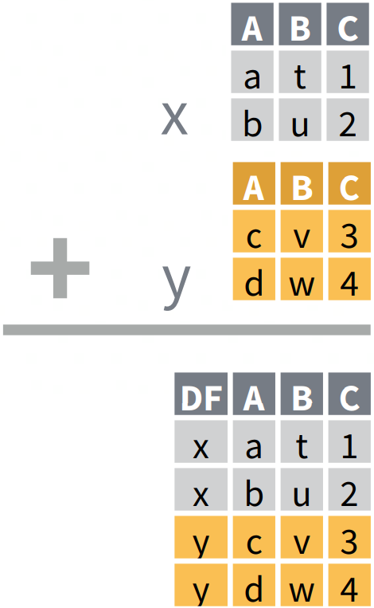
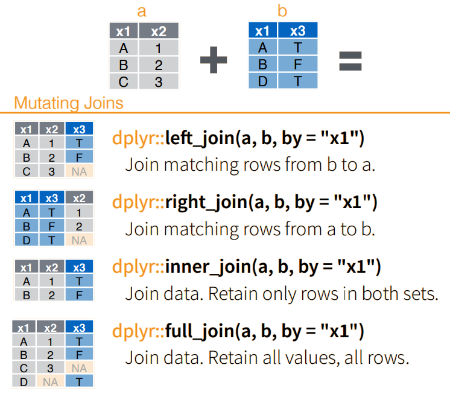
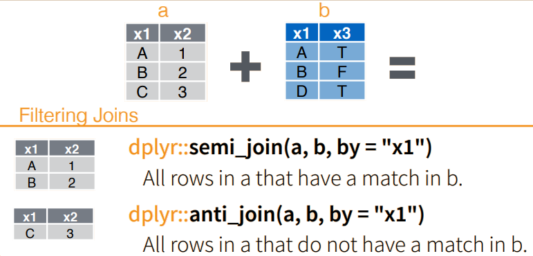

```{r setup, include=FALSE}
options(width = 60)
knitr::opts_chunk$set(echo = TRUE, rows.print=6)
options(tibble.print_max = 6, tibble.print_min = 4)
```

## Programme

- Pipe syntax
- Data manipulation: 
  - Choosing variables and rows in the data (`select` and `filter`)
  - Renaming and changing variables, as well as calculating new variables (`rename` and `mutate`)
  - Combining, joining and merging data


## Packages in this session

**Remember:** A *package* is a collection of functions and data. We load a package with the function `library`, which gives us access to the contents of the package. 

```{r, message=FALSE}
library(nycflights13)
library(dplyr)
# or:
library(tidyverse)
```

```{r echo=F, out.width='25%', out.extra='style="float:right; padding:5px"'}
knitr::include_graphics("figurer/dplyr_logo.png")
```

`dplyr` is the large data-manipulation package, which contains functions for manipulating data by choosing rows and columns, create new variables, sort data, combine and merge datasets and summarising data. 


## Overview of data

When working with new data, it is a good idea to get an overview of the dataset

```{r}
glimpse(flights)
```


# About pipes 

## What a pipe does

`select` is a function in the `dplyr` package, which selects variables in a dataset. It can be used like this: 
```{r, eval=FALSE}
select(flights, carrier, dest)
```
*(first argument is your input data, the following arguments are the ones you want to select)*

Alternatively, pipe syntax can be used:
```{r, eval=FALSE}
flights |> select(carrier, dest)
```
The pipe `|>` pulls everything to the left of it through the pipe and inserts it into the first argument of the function on the right-hand side. You can think of it as **...and then ...**


## What a pipe does
```{r}
flights
```


## What a pipe does
```{r}
flights |> select(carrier, dest)
```

## Why use a pipe?

Pipes lets us chain together commands in a way that is more readable. 

**Without pipes**

```{r, eval=FALSE}
new_data <- select(flights, carrier, arr_delay, distance)
new_data <- filter(new_data, distance > 1000)
new_data <- mutate(new_data, arr_delay = if_else(arr_delay > 0, "YES", "NO"))
```

**With pipes**

```{r, eval=FALSE}
new_data <- flights |> 
  select(carrier, arr_delay, distance) |> 
  filter(distance > 1000) |> 
  mutate(arr_delay = if_else(arr_delay > 0, "YES", "NO"))
```

## Other pipes

- The pipe `|>` is the native pipe in R from version 4.1 onwards
- Can be produced by using Ctrl + Shift + m
- Before the native pipe, the `%>%` pipe from the `magrittr` package was used. It does practically the same thing.
  - If you come across code containing `%>%`, you can usually either run it as is or replace it with `|>`
- `magrittr` contains a number of other pipes for specific uses that we won't touch upon here

## Pipe settings
To be able to use Ctrl+Shift+m for producing `|>`, we need to tick the box 'Use native pipe operator' in Tools --> Global options --> Code

```{r echo=F, out.width='55%', out.extra='style="float:center; padding:5px"'}
knitr::include_graphics("figurer/native_pipe_option.png")
```

# Datamanipulation with dplyr

## Selecting columns in your dataset

**select**      
  
```{r, echo = TRUE, }
flights |> 
  select(carrier, dest)
```

## Selecting columns in your dataset

**deselect / drop**  
```{r}
flights |> 
  select(-month, -day)
```

## Selecting columns in your dataset
- Helper functions in `select`    
    - starts_with(), ends_with(), contains(), matches()


## Renaming columns

```{r}
flights |> 
  rename(departure = dep_time)
```

## Renaming columns

'rename_with' can be used for renaming all or a selection of columns at the same time with a function

```{r}
flights |> rename_with(toupper, everything()) 
```


## Renaming columns

'rename_with' can be used for renaming all or a selection of columns at the same time with a function

```{r}
flights |> rename_with(toupper, contains("r")) 
```

## Selecting rows

**filter**  

```{r}
flights |> 
  filter(distance > 1000) 
```

## Selecting rows

Use `&` (and) or `|` (or) to filter the data on multiple conditions

```{r}
flights |> 
  filter(distance > 1000 & month == 12)
```

## Selecting rows

Helper functions for `filter`  

- `if_all()` and `if_any()` 

```{r}
flights |> 
  filter(if_all(contains("delay"), ~.x > 0))
```


## Creating new variables

**mutate**

```{r}
flights |> mutate(arr_delay = if_else(arr_delay > 0, "YES", "NO"), 
                  distance_km = 1.61 * distance,
                  .keep = "used")
```

## Mutate: if_else and case_when

```{r, eval=TRUE}
flights |> 
  mutate(arr_delay = if_else(arr_delay > 0, "YES", "NO"),
         flight_type = case_when(distance < 500 ~ "Short flight",
                                 air_time > 180 ~ "Long flight",
                                 TRUE ~ "Medium flight"),
         .keep = "used")
```

# Exercises D1

# Combining data

## bind_rows()

```{r echo=F, out.width='30%', out.extra='style="float:left; padding:20px"'}

```


`bind_rows()` attaches tables after each other - for example datasets from different years: 

`bind_rows(data1, data2)`
         
There is also a `bind_cols()` function, but it is generally bad practice to use that - rows might not be sorted in the same way.


## Joins

When tables are combined by one or more ID variables, it is called a *join* 

The following types of joins are available:

- **Mutating joins**
    - left_join()  
    - inner_join()  
    - full_join()  
    - right_join() (Less used)  
    
- **Filtering joins**
    - semi_join()  
    - anti_join()  
    
## "Mutating" joins

```{r echo=F, out.width='80%'}

```

## "Filtering" joins

```{r echo=F, out.width='80%'}

```

## Example join
```{r, echo=FALSE}
flights2 <- flights |> select(year:day, hour, tailnum, carrier)

options(tibble.print_max = 3, tibble.print_min = 3)
```

```{r}
flights2
airlines
```

## left_join

Joining the airlines with the flights2 dataset based on the 'carrier' column.

```{r}

flights2 |> 
  left_join(airlines, by = "carrier")
```

## Another example

```{r}
planes
```


## inner_join

Finding all planes with the engine type 'Reciprocating' in the planes dataset, then adding the production year and number of seats to the dataset.

```{r}
flights2 |> 
  inner_join(planes |> 
               filter(engine=="Reciprocating") |> 
               select(tailnum, year_prod = year, seats),
             by = "tailnum") |> 
  head(4)
```

## semi_join

First creating a dataset with selected airlines to use with the filter joins.

```{r}

selected_airlines <- airlines |> 
              filter(str_detect(str_to_upper(name), "AIRWAYS"))

selected_airlines

```                     
           

## semi_join

Semi-joining our dataset with flights2.

```{r}

flights3 <- flights2 |> 
  semi_join(selected_airlines, by = "carrier")

flights3 |> head()

```

## semi_join

Counting to see if there is only the type of 'carrier' that we expect.

```{r}
flights3 |> 
  count(carrier)
```


## anti_join

The opposite procedure can be done with `anti-join`

```{r}

flights4 <- flights2 |> 
  anti_join(selected_airlines, by = "carrier")

flights4 |> head()

```

## anti_join

Checking if any of the carriers in selected_airlines exist in flights4.

```{r}
flights4 |> 
  semi_join(selected_airlines, by = "carrier")
```


## Further reading:

`dplyr`  

  - [R4DS2e - 4 Data transformation](https://r4ds.hadley.nz/data-transform.html)
  
  - [R4DS2e - 5 Pipe workflow](https://r4ds.hadley.nz/workflow-style.html#sec-pipes)
  
  - [R4DS2e - 19 Joins](https://r4ds.hadley.nz/joins.html)


# Exercises D2