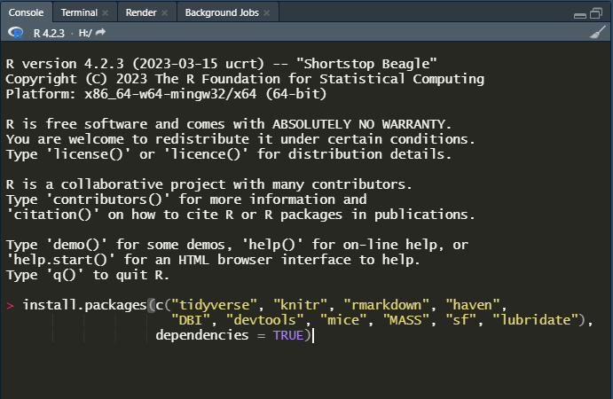

# Intro {.sidebar}

This dashboard covers the materials for the course introducing R to be held in Banja Luka, October 16 - 18, 2023.

---

Instructor: 

 - Peter Stoltze (psl@dst.dk)


---

Material adopted from [Gerko Vink](https://github.com/gerkovink/R) and extended by several employees from [Statistics Denmark](http://www.dst.dk/en/).


---
# Quick Overview

## Column 1

### Outline
R is a popular platform for manipulation, visualization and analysis of data and has a number of advantages over other statistical software packages. A wide community of users (including methodologists within official statistics) contribute to R, resulting in an enormous coverage of statistical procedures, including many that are not available in any other statistical program. Furthermore, it is highly flexible for programming and scripting purposes, for example when manipulating data or creating professional plots.

However, R lacks standard GUI menus, as in SPSS for example, from which to choose what statistical test to perform or which graph to create. As a consequence, R is initially more challenging to master. This course offers an introduction to statistical programming in R, that you can built upon after the course. 

The course starts at a very basic level and builds up gradually. No previous experience with R is required. It is very important to realize, that you will not become a master R programmer in three days, but you will get the tools to start your journey. As with every other endavor, training is the key. Luckily, experience tells us that you will relatively quick become proficient with R.  

I hope we will have some productive days together :-)

## Column 2

### Course schedule 

| Time        | Topic                                           |
|:------------|:------------------------------------------------|
| *Monday*    |                                                 |
| 10.00-12.00 | Introduction to R and RStudio                   |
|             | *Break*                                         |
| 13.00-15.30 | Datatypes in R and basic syntax                 |
| *Tuesday*   |                                                 |
| 09.00-11.30 | Reading external data into R                    |
|             | *Break*                                         |     
| 13.00-15.30 | Data manipulation and tidyverse                 |
| *Wednesday* |                                                 |
| 09.00-11.30 | Your own project                                |
|             | *Break*                                         |             
| 13.00-15.30 | Your own project (continued)                    |
<!-- | *Thursday*  |                                                 | -->
<!-- | 08.30-10.30 | Examples with data from CBBH                    | -->
<!-- |             | *Break*                                         | -->
<!-- | 13.00-15.30 | Introduction to visualization and reports       | -->


# How to prepare

## Column 1

### Preparing your machine for the course
The below steps guide you through installing both `R` as well as the necessary additions.

### **System requirements**

Bring a computer to the course and make sure that you have full write access and administrator rights to the machine. We will explore programming and compiling in this course. This means that you need full access to your machine. Some corporate laptops come with limited access for their users, we therefore advice you to bring a personal laptop computer, if you have one. 

### **1. Install `R`**
`R` can be obtained [here](https://cran.r-project.org). We won't use `R` directly in the course, but rather call `R` through `RStudio`. Therefore it needs to be installed. If you are on a Windows machine, choose Windows and then "*Binaries for base distribution. This is what you want to install R for the first time*". Follow the instructions and accept default settings. 

### **2. Install `RStudio` Desktop**

Rstudio is an Integrated Development Environment (IDE). It can be obtained as stand-alone software [here](https://www.posit.co/downloads/). The free and open source `RStudio Desktop` version is sufficient. Again, follow the instructions and accept default settings.

### **3. Start RStudio and install the following packages. **

For this course we will need a number of *packages*. Execute the following lines of code in the console window:

```{r eval=FALSE, echo = TRUE}
install.packages(c("tidyverse", "knitr", "rmarkdown", "haven",
                   "DBI", "devtools", "mice", "lubridate", "openxlsx",
                   "RSQLite"), 
                 dependencies = TRUE)
```


If you are not sure where to execute code, use the following figure to identify the console:

<center>
  
</center>

Just copy and paste the installation command and press the return key. When asked 

```{r eval = FALSE, echo = TRUE}
Do you want to install from sources the package which needs 
compilation? (Yes/no/cancel)
```

type `Yes` in the console and press the return key. This might seem tricky first time, but installing packages will soon become second nature.

# Monday 

## Column 1

### Monday's materials

We adapt the course as we go. To ensure that you work with the latest iteration of the course materials, I advice all course participants to access the materials online at [peterstoltze.github.io/R_BiH_2023](https://peterstoltze.github.io/R_BiH_2023/).

Lecture presentation and exercises will be made available here. Download the files and put them in their own directory.

- Part A: Introduction
    - [Lecture A](Contents/Part A - Introduction/Lecture_A.html){target="_blank"}
    - [Practical A](Contents/Part A - Introduction/Practical_A_walkthrough.html){target="_blank"}
    - Files for Practical A:
        - [`notebook.R`](Contents/Part A - Introduction/notebook.R){target="_blank"}
        - [`markdown.Rmd`](Contents/Part A - Introduction/markdown.Rmd){target="_blank"}

- Part B: Datatypes and Syntax
    - [Lecture B](Contents/Part B - How is R organized/Lecture_B.html){target="_blank"}
    - [Practical B](Contents/Part B - How is R organized/Practical_B.html){target="_blank"}
    - Files for Practical B:
        - [`boys.RData`](Contents/Part B - How is R organized/boys.RData){target="_blank"}
        - [Practical B (walkthrough)](Contents/Part B - How is R organized/Practical_B_Walkthrough.html){target="_blank"}
    
Lectures and practicals are in `html` format and open in a new browser pane. For some practicals there are supplementary files, that you should download and store in a folder on your own computer. Sometimes the supplementary material includes a walkthrough (solution) to the exercise, but try to solve the practical by yourself first.

<!-- # Tuesday -->
<!-- We adapt the course as we go. To ensure that you work with the latest iteration of the course materials, we advice all course participants to access the materials online. -->

<!-- Lecture presentation and exercises will be made available here. Download the files and put them in their own directory. -->

<!-- - Part C: Packages and reading external data -->
<!--     - [Lecture C](Contents/Material/Part C - Reading external data/Lecture_C.html){target="_blank"} -->
<!--     - [Practical C](Contents/Material/Part C - Reading external data/Practical_C.html){target="_blank"} -->
<!--     - [Practical C - With walkthrough](Contents/Material/Part C - Reading external data/Practical_C_walkthrough.html){target="_blank"} -->

<!-- - Part D: Data manipulation and tidyverse -->
<!--     - [Lecture D](Contents/Material/Part D - Data manipulation/Lecture D.html){target="_blank"} -->
<!--     - [Practical D1](Contents/Material/Part D - Data manipulation/Practical D1.html){target="_blank"} -->
<!--     - [Practical D2](Contents/Material/Part D - Data manipulation/Practical D2.html){target="_blank"} -->

<!-- All lectures are in `html` format. Practicals are are provided both as naked questions but also with ample explanations and solutions - choose according to your taste! -->


<!-- # Wednessday -->

<!-- We adapt the course as we go. To ensure that you work with the latest iteration of the course materials, we advice all course participants to access the materials online. -->

<!-- Lecture presentation and exercises will be made available here. Download the files and put them in their own directory. -->

<!-- - Part E: Summary stats -->
<!--     - [Lecture E](Contents/Material/Part E - Summary stats/Lecture_E.html){target="_blank"} -->
<!--     - [Practical E](Contents/Material/Part E - Summary stats/Practical_E.html){target="_blank"} -->

<!-- - Part F: Strings and dates -->
<!--     - [Lecture F](Contents/Material/Part F - Strings and dates/Lecture_F.html){target="_blank"} -->
<!--     - [Practical F1](Contents/Material/Part F - Strings and dates/Practical_F1.html){target="_blank"} -->
<!--     - [Practical F2](Contents/Material/Part F - Strings and dates/Practical_F2.html){target="_blank"} -->

<!-- All lectures are in `html` format. Practicals are are provided both as naked questions but also with ample explanations and solutions - choose according to your taste! -->

<!-- # Thursday -->

<!-- We adapt the course as we go. To ensure that you work with the latest iteration of the course materials, we advice all course participants to access the materials online. -->

<!-- Lecture presentation and exercises will be made available here. Download the files and put them in their own directory. -->

<!-- - Part G: Recreating the BoP for MaR -->
<!--     - [Lecture G](Contents/Material/Part G - CBBH example/Lecture_G.html){target="_blank"} -->
<!--     - [example.R](Contents/Material/Part G - CBBH example/example.R){target="_blank"} -->

<!-- - Part H: Plots and reports -->
<!--     - [Lecture H](Contents/Material/Part H - Plots and reports/Lecture_H.html){target="_blank"} -->
<!--     - [Practical H](Contents/Material/Part H - Plots and reports/Practical_H.html){target="_blank"} -->
<!--     - [Practical H - With walkthrough](Contents/Material/Part H - Plots and reports/Practical_H_walkthrough.html){target="_blank"} -->
<!--     - [some_data.xlsx](Contents/Material/Part H - Plots and reports/some_data.xlsx){target="_blank"} -->
<!--     - [example.Rmd](Contents/Material/Part H - Plots and reports/example.Rmd){target="_blank"} -->

<!-- All lectures are in `html` format. Practicals are are provided both as naked questions but also with ample explanations and solutions - choose according to your taste! -->

# Further studies

## Column 1

### What to do after the course

The following references are currently available for free, either as pdfs or as extensive webpages (written with [RMarkdown](https://rmarkdown.rstudio.com/) and [bookdown](https://bookdown.org/)). They are all very useful and we highly recommend them. 

- [R for Data Science](https://r4ds.had.co.nz): written by Hadley Wickham and Garrett Grolemund this book relies almost exclusively on the [tidyverse](https://www.tidyverse.org/) approach to data analysis. Many highly effective tools will be right at your fingertips after reading this book and working through the many exercises.
- [Advanced R](https://adv-r.hadley.nz/): You want to gain deeper knowledge of R and you wnat to learn from one of the most influential R contributors. This one is for you!
 - [Rmarkdown](https://bookdown.org/yihui/rmarkdown/): A very thorough look at RMarkdown. No need to read everything, but if there is a subject you struggle with, take a look at the index.
 - [ggplot2 - The book](https://ggplot2-book.org/): The ultimate guide to `ggplot` written by Hadley Wickham who is also the author to the package. It is quite long, but if you want to truely understand it, this is the place to start.

[Happy Git and GitHub for the useR ](https://happygitwithr.com/index.html) is a great introduction to version control using Git and GitHub together with RStudio. Written by Jenny Bryan in a very concise style. Version control is highly recommended as the backbone of a reproducible workflow!

I also recommend looking at [Awesome official statistics software](https://github.com/SNStatComp/awesome-official-statistics-software), which guides you to great resource for official statistics organised by GSBPM.

Finally we have to mention [ChatGPT](https://chat.openai.com/) which even in the free GPT-3.5 version is a quite capable R programmer! You can use ChatGPT to explain what a piece of R code is doing, or you can use ChatGPT to suggest code for a certain task. But as in every other setting, the more precise you are able to phrase the question, the better the answer will generally be. Of course, you need to validate the output from ChatGPT yourself, and of course no sensitive information should be handed over to ChatGPT. 